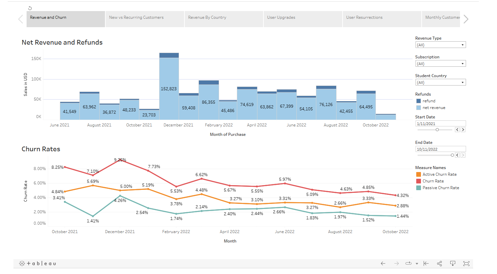
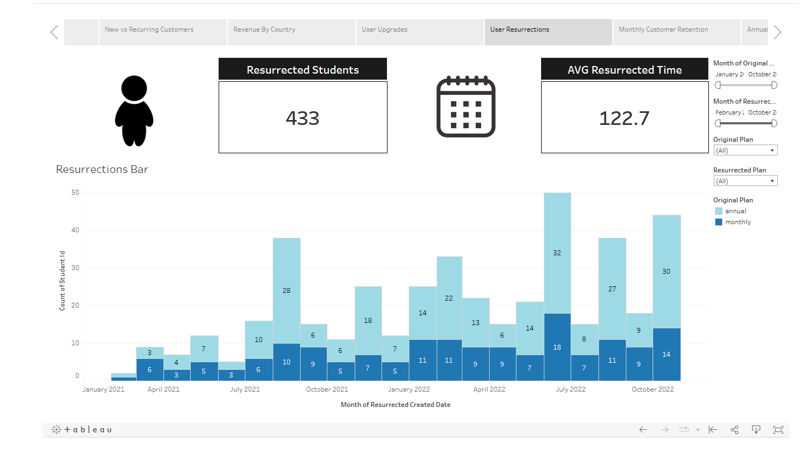
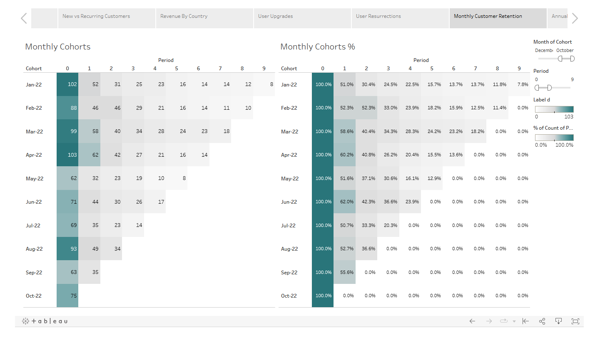

# Customer Churn Analysis Using Tableau
## Motivation
This was a guided project based off of 365 Data Science data. The goal was to create a multi functional dashboard based on customer data from the 365 Data Science Platform. 

## Data Tools
The queries can be done in MySQL and the data could also be downloaded from their website if you are a subscriber. This project opted to download the CSV files directly and create the dashboard in Tableau. The data is also included into this repository as the downloaded data acquired from link comes from the website.

## Data Understanding
There were Dashboard created for each of these categories:

- Revenue and Churn
- New vs Recurring Customers
- Revenue By Country
- User Upgrades
- User Resurrections
- Monthly Customer Retention
- Annual Customer Retention

### <b> Revenue and Churn </b>

Revenue is the money generated from normal business operations. In this case, the primary focus is Net Revenue. Net Revenue is defined in this case as Gross Revenue (total revenue generated from consumers) minus Cost of Goods Sold (COGS) and Expenses.

Churn is when a consumer discontinues their subscriptions with a company. (in this case, this platform is a subscription platform)

NOTE: a Refund does not always imply churn. Some consumers may get a refund for a multitude of reasons and still proceed on with a company's services.
#### <b> Observations </b>

#### <b> Bar Chart </b>
- In November of 2021, there was a massive spike in Net Revenue. One thing to note is that during this period a promotion for Black Friday could have set this spike into motion. 
- October 2021, there was a lot less revenue as well which may have seemed like a cause for concern but when looking forward or back a year, it is within range for the normal amounts of revenue for that month. 
#### <b> Line Chart </b>
- The churn rather over time has actually decreased. This means thgat customers have been satisfied with the product and find value in what the platform provides.
- Active churn rates are higher than passive churn rates so it may be area of focus if the strategy shifts to focusing on active churned customers. Surveys can be given to those customers to get a clear understanding on why they are leaving the platform.

&nbsp;

### <b> User Resurrections </b>

When bringing back a customer, it could be crucial to understand how many customers a company is bring back and how long did it take for them to comes back. This business operates primarily on monthly and annual subscriptions.

#### <b> Observations </b>
- From February 2021 to October 2022, they were able to bring back a total of 433 students. The highest re-acquired in a month was June 2022 at 50 students and the lowest in Feburary 2021 with 2 students. This could have been due to promotional improvements over time.

- The average amount of days in which it takes for a student to come back is 122.7 days. Since this number is a combination of both annual and monthly reacquisitions with roughly more than 50% coming back from an annual subscription, it can be seen as reasonable.

-  The majority that came back had the annual plan as their original plan. They could imply the demographic for retargeting.

&nbsp;

### <b> Monthly Cohorts </b>

Cohort Analysis provides valuable insights into the performance and behavior of different groups of customers or users over time.

#### <b> Observations </b>
- Customer retention rates after the first month of acquisition vary between approximately 50% to 62%. This range indicates that there is a mix of cohorts with different engagement levels.

- the February cohort demonstrated robust retention during period 2, consistently staying in the 50% range.

    - NOTE: The customers who stayed for period 2 does not necessarily all from period 1. It is important to understand that as long as someone in the cohort makes a purchase in a given month after their acquisition month, they will be added to that specific period.
Example: If someone was acquired in Jan-2022 but skipped Feb-2022 and proceeded in Mar-2022, they would appear in Jan and Mar but not Feb.

-  This analysis suggests that some cohort members could have transitioned from monthly plans to annual plans. The cohort members might have been offered incentives or discounts for annual subscriptions, motivating them to make the switch.

&nbsp;

## If you'd like to dive further in and see the dashboard, it is linked here: 
[Interactive Dashboard](https://public.tableau.com/app/profile/jonathan.roman/viz/365_customer_churn_16902974664830/CustomerChurnStory?publish=yes)

## References

[Customer Churn Analysis with Tableau | 365 Data Science - Elitsa Kaloyanova](https://365datascience.com/)
